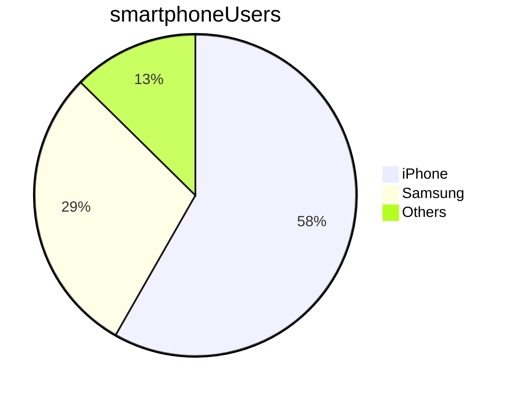

# Tech509_Week3

This is plain text


### This is a h3 header

###### This is an h6 headerrr

*This is italic text*

_This is also italic_

**This is bold**

__This is also bold__

__Bold but only *partly* italic__

> This is a quote
>> This is the subordinate part
> 

* this is an lis
* with some items in it
* I've added another item

- or you can use a dash
- to make a list 
- of this
- 
Numbered lists:
1. Part 1
3. Part 3
4. Part 4


https://guides.github.com/pdfs/markdown-cheatsheet-online.pdf

[Markdown Cheatsheet](https://guides.github.com/pdfs/markdown-cheatsheet-online.pdf)

[Link to the level 6 header](#this-is-an-h6-header)

## Github Flavored Markdown

```java
public class Person {
    private int age;
    private String nickName;
    public int getAge() {
        return age;
    }
    public void setNickName(String newNickName) {
        this.nickName = newNickName;
    }
     public String getNickName() {
        return this.nickName;
    }
}
```

```csharp
public static void Main() {
    Console.WriteLine("Hello World");
```

#### Task lists
- [ ] This is a list 
- [x] This is a finished item

#### Tables

Name  | Street |  Town
------|--------|-------
Cathy | Main St | Birmingham
John | Maple Dr | Nottingham

#### Mermaid



#### Peter's Edit
- New list item1
- New list item2
- New list item3

